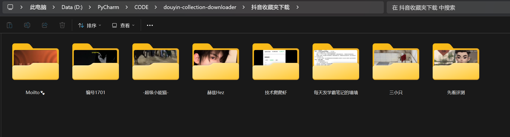
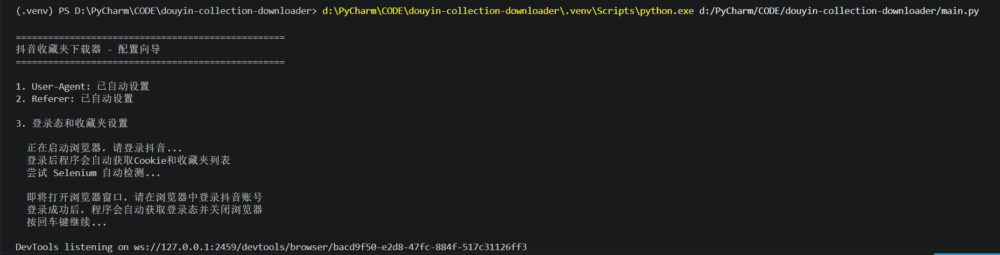
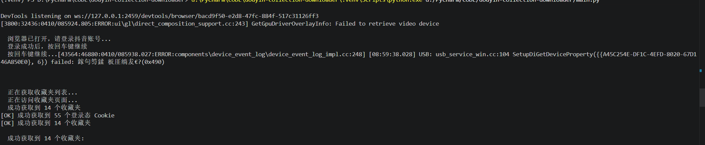
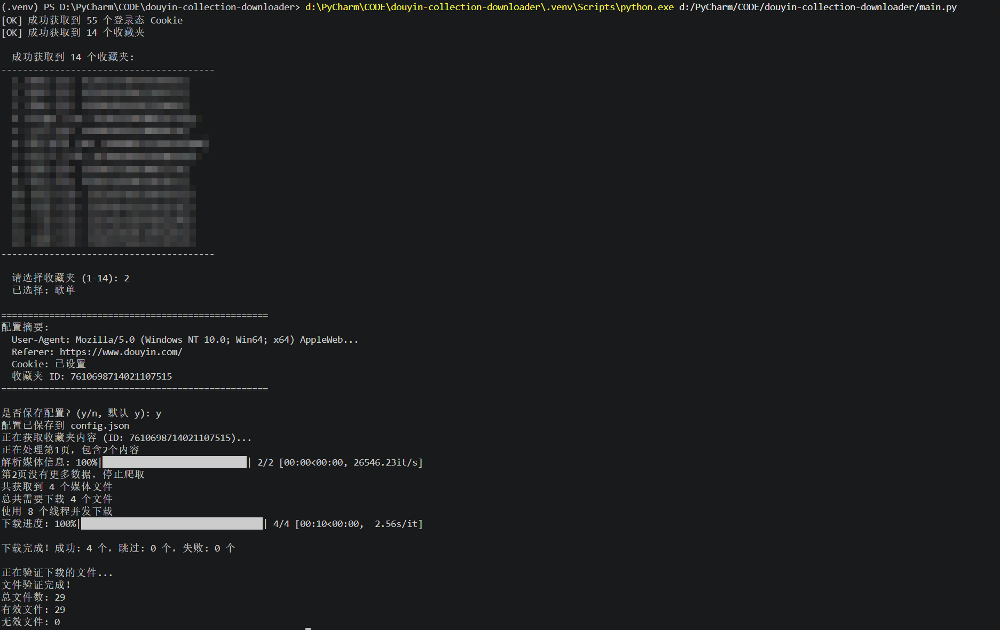

#                     Python批量爬取抖音收藏夹图片和视频

 **目录**

[功能展示](#功能展示)

[如何使用](#如何使用)

[环境准备](#环境准备)

------


# 功能展示



# 





# 如何使用
1.安装依赖

```bash
pip install -r requirements.txt
```

2.运行程序

```bash
python main.py
```

3.首次运行会自动打开浏览器，登录抖音账号后按回车

4.程序自动获取收藏夹列表，输入序号选择要下载的收藏夹

5.视频和图片会下载到 `抖音收藏夹下载/作者名/` 目录


## 环境准备

- Python 3.7+
- Windows 系统需要安装 Edge 浏览器（系统自带）
- 首次使用需要登录抖音网页版

## 功能特点

- 自动获取浏览器登录态，无需手动复制Cookie
- 自动获取收藏夹列表，选择序号即可下载
- 支持视频和图片下载
- 自动选择最高画质
- 8线程并发下载
- 断点续传，已下载内容自动跳过

## 打包 EXE

如果你希望别人不安装 Python，直接双击使用，可以在项目根目录执行：

```powershell
powershell -ExecutionPolicy Bypass -File .\build_exe.ps1
```

生成完成后，EXE 在：

```text
dist\douyin-collection-downloader.exe
```

说明：

- 程序运行时会在 EXE 同目录生成 `config.json`
- 下载内容会保存到 EXE 同目录下的 `抖音收藏夹下载` 文件夹
- 首次运行仍然需要本机可用的 Edge 浏览器，用于登录抖音
- 如果你只想安装打包依赖，可以执行 `pip install -r requirements-build.txt`


